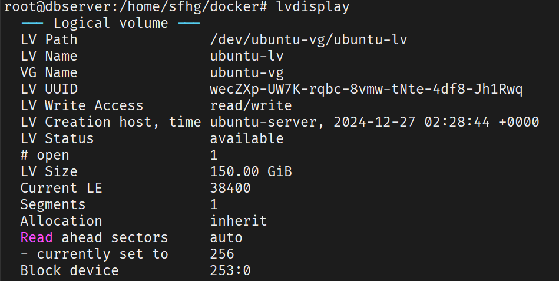

### 使用`lvdisplay`查看当前逻辑卷信息



### 复制 `LV Path` `/dev/ubuntu-vg/ubuntu-lv`

使用` lvextend -L +50G /dev/ubuntu-vg/ubuntu-lv `对逻辑卷进行扩容50G

### 刷新分区情况

使用` resize2fs /dev/ubuntu-vg/ubuntu-lv `刷新，然后使用` df -h `查看分区情况

## 新系统磁盘挂载记录

1. 使用 `df -hT` 命令查看当前磁盘的挂载、已用大小、可用大小以及文件系统类型

    ```
    root@user:~# df -hT
    Filesystem                        Type   Size  Used Avail Use% Mounted on
    tmpfs                             tmpfs   13G  2.9M   13G   1% /run
    /dev/mapper/ubuntu--vg-ubuntu--lv ext4    98G   12G   82G  13% /
    tmpfs                             tmpfs   63G     0   63G   0% /dev/shm
    tmpfs                             tmpfs  5.0M     0  5.0M   0% /run/lock
    /dev/sda2                         ext4   2.0G  126M  1.7G   7% /boot
    /dev/sda1                         vfat   1.1G  5.3M  1.1G   1% /boot/efi
    tmpfs                             tmpfs   13G  4.0K   13G   1% /run/user/1000
    tmpfs                             tmpfs   13G  4.0K   13G   1% /run/user/0
    ```
2. 使用 `lsblk` 列出块设备（如硬盘、分区、LVM 卷等）及其挂载信息
    ```
    root@user:~# lsblk
    NAME                      MAJ:MIN RM   SIZE RO TYPE MOUNTPOINTS
    loop0                       7:0    0  61.9M  1 loop /snap/core20/1405
    loop1                       7:1    0  79.9M  1 loop /snap/lxd/22923
    loop3                       7:3    0  50.9M  1 loop /snap/snapd/24505
    loop4                       7:4    0  89.4M  1 loop /snap/lxd/31333
    sda                         8:0    0 446.1G  0 disk
    ├─sda1                      8:1    0     1G  0 part /boot/efi
    ├─sda2                      8:2    0     2G  0 part /boot
    └─sda3                      8:3    0 443.1G  0 part
    └─ubuntu--vg-ubuntu--lv 253:0    0   100G  0 lvm  /
    sdb                         8:16   0   2.2T  0 disk
    ```
3. 根据上述磁盘情况可知，根目录挂载在逻辑卷 `ubuntu--vg-ubuntu--lv` 上。
这个逻辑卷是通过 LVM（Logical Volume Manager） 管理的。

4. 设备层级：
   - 物理磁盘：sda 是一个 446.1GB 的磁盘。

   - 分区：
     - sda1（1GB）：挂载为 /boot/efi（EFI 系统分区，通常用于 UEFI 启动）。
     - sda2（2GB）：挂载为 /boot（存放内核和启动文件）。
     - sda3（443.1GB）：用作 LVM 物理卷（Physical Volume, PV）。

   - LVM 结构：
     - sda3 被分配给一个 LVM 卷组（Volume Group, VG），名为 ubuntu--vg。
     - 在 ubuntu--vg 中，创建了一个逻辑卷（Logical Volume, LV），名为 ubuntu--lv，大小为 100GB。
     - 这个逻辑卷 ubuntu--vg-ubuntu--lv 被格式化并挂载为根目录（/）。 
5. 扩展逻辑卷 ubuntu-lv ，使用 `sudo lvextend -L +100G /dev/ubuntu-vg/ubuntu-lv` 命令可以扩展 100G 空间。
6. 扩展文件系统，扩展逻辑卷后，你还需要扩展文件系统，以便操作系统能识别和使用新增的空间。由于根目录是 ext4 类型（从 df -hT 结果推断），可以使用 resize2fs，详细命令为 `sudo resize2fs /dev/ubuntu-vg/ubuntu-lv`。
7. 验证，使用 `df -hT /` 可查看根目录空间已增加。
8. 挂载 `sdb`并将其加入逻辑组。
9. 在 sdb 上创建一个单一分区，然后将该分区作为 LVM PV
操作步骤示例：

   1. 分区 sdb：
        ```Bash
        sudo fdisk /dev/sdb
        # 在 fdisk 交互界面中：
        #   n      # 创建新分区
        #   p      # 主分区
        #   1      # 分区号 1
        #   回车   # 接受默认起始扇区
        #   回车   # 接受默认结束扇区，使用整个磁盘
        #   t      # 改变分区类型
        #   8e     # LVM 的十六进制代码
        #   w      # 写入分区表并退出
        ```
        这将创建 /dev/sdb1。

    2. 创建 LVM 物理卷：

        ```Bash
        sudo pvcreate /dev/sdb1
        ```
    3. 扩展卷组：

        ```Bash
        sudo vgextend ubuntu-vg /dev/sdb1
        ```
10. 查看逻辑组可用空间大小 `sudo vgdisplay ubuntu-vg`
    ```bash
    root@user:~# vgdisplay ubuntu-vg
    --- Volume group ---
    VG Name               ubuntu-vg
    System ID
    Format                lvm2
    Metadata Areas        2
    Metadata Sequence No  4
    VG Access             read/write
    VG Status             resizable
    MAX LV                0
    Cur LV                1
    Open LV               1
    Max PV                0
    Cur PV                2
    Act PV                2
    VG Size               2.43 TiB
    PE Size               4.00 MiB
    Total PE              637707
    Alloc PE / Size       76800 / 300.00 GiB
    Free  PE / Size       560907 / <2.14 TiB
    VG UUID               2qRo3Y-uar3-Ww6i-tKwf-cQkN-vHiR-MxCfEO
    ```
    可知有 2T 多的可用空间，说明 /dev/sdb1 已经成功加入逻辑组
11. 再使用步骤 5、6 的命令进行空间扩展
    ```bash
    lvextend -L +1000G /dev/ubuntu-vg/ubuntu-lv
    sudo resize2fs /dev/ubuntu-vg/ubuntu-lv
    ```
12. 使用 `df -hT` 进行验证，至此，磁盘挂载及扩容完成。