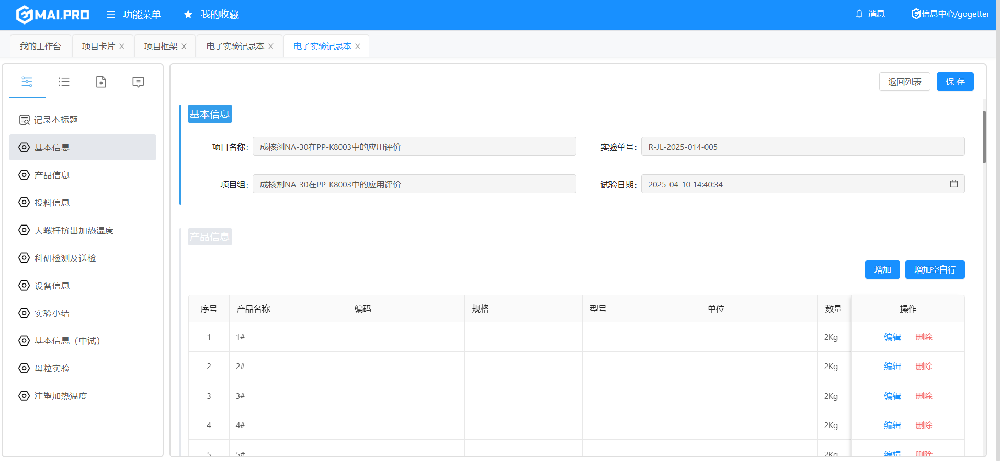
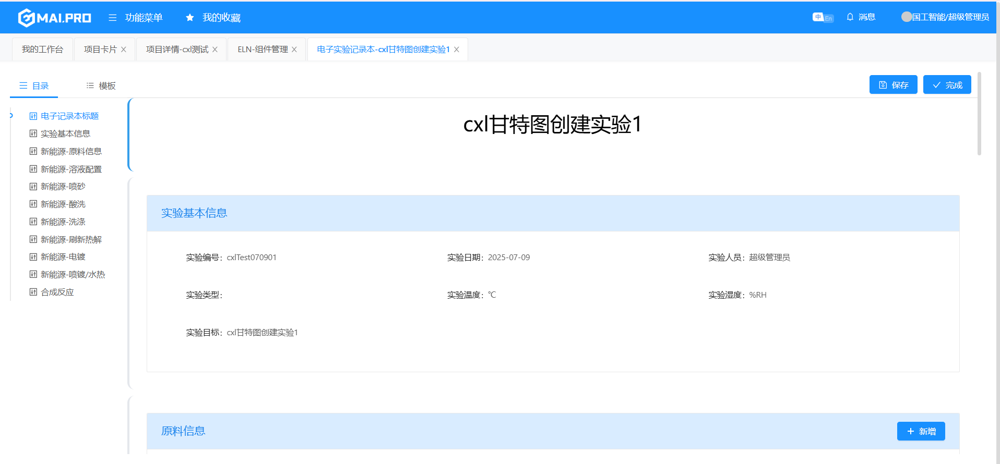

# 电子实验记录本

> `RDM` 系统主要功能是 项目管理 和 电子实验记录本(`ELN`)；

> 项目管理就是管理整个项目的生命周期，即项目从立项到归档的整个流程

> `ELN` 记录研发人员的实验过程，基本上每个客户的业务领域各不相同，因此对实验记录本的业务需求也不一样。所以，ELN采用组件化的形式，并可以形成不同的实验模板供客户使用。

## 新旧版本对比





## 新版ELN内容介绍

1. 主要分为两部分，左侧的菜单及右侧的内容
2. 左侧又分为 `目录` 和 `模板` 两部分。其中，目录是已有的组件菜单，可以点击并跳转到对应的组件；模板是已选和可选组件模板

## 组件添加

1. 在 `ELN-组件管理` 菜单可以添加组件。根据类型不同，分为 低代码组件 和 自开发组件 两种
2. 低代码组件直接选择对应的kform表单
3. 自开发组件填写组件路由，例如 `views/researchdb/plus/SyntheticRoutePlus.vue`
4. 添加完成后就可以在实验记录本的`模板`处进行组件选择

## 保存逻辑

1. 低代码组件：例如`电子实验记录本-操作过程`，可以看到该页面有一个`保存操作过程`的数据事件，但是没有对应的按钮逻辑触发该事件，这里的保存是如何触发的？右上角有个整体保存的按钮

2. 自开发组件：根据业务需求自行开发，自开发组件可以采取的数据保存就比较多样化了。对于表格这种形式的组件，可以用watch去监视数据的变化，进而去执行对应的保存方法；也可以使用电子实验记录本的整体保存按钮，这时候就要实现 `getSaveInfo`方法，也相当于去调用后端的接口。

3. 对于自开发组件，可以使用如下代码获取参数数据源,因为`customPage.vue`中通过`:parametersValue="parameterValue"`进行传参
   
   ```js
    props: {
        parametersValue: {
            type: Object,
            default: () => ({})
        }
    }
   ```
