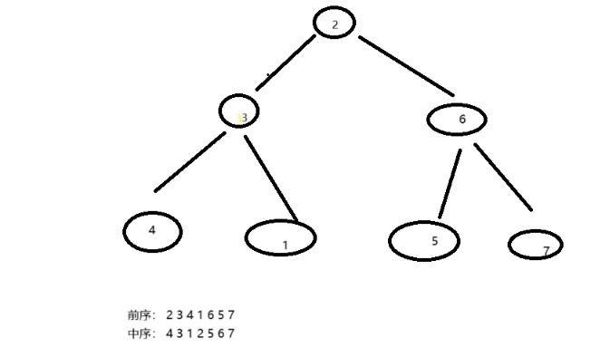

# 分治构建树

> 已知一棵树的前序遍历序列为 [2,3,4,1,6,5,7] ，中序遍历序列为 [4,3,1,2,5,6,7] ，构建出这棵树。

根据树的遍历方式，可知前序遍历为 根节点 + 左子树 + 右子树，中序遍历为 左子树 + 根节点 + 右子树。



所以前序遍历的第一个元素为根节点，根节点在中序遍历中的位置可以将中序遍历分为左子树和右子树。

即 [4,3,1] 为左子树，[5,6,7] 为右子树。

基于变量描述子树区间，根据上述的划分方法，已经得到根节点、左子树、右子树在前序遍历和中序遍历中的区间索引，为了描述这些索引区间，引入如下指针变量：

- 当前树的根节点在 前序遍历 中的索引记为 i。
- 当前树的根节点在 中序遍历 中的索引记为 M。
- 当前树在 中序遍历 中的索引区间记为 [L,R]。

|     | 根节点在 前序遍历 中的索引 | 子树在 中序遍历 中的索引区间 |
|-----|----------------|-----------------|
| 当前树 | i              | [L,R]           |
| 左子树 | i+1            | [L,M-1]         |
| 右子树 | i+1+(M-L)      | [M+1,R]         |

右子树节点索引中的 (M-L) 的含义是“左子树的节点数量”

```
前序遍历 [2,    3,   4,  1,     6,         5,  7]
         i     i+1           i+1+(M-L) 
         
中序遍历 [4,    3,  1,   2,   5,  6,  7]
         L              M            R

继续对左子树进行处理，其中

前序遍历为 [3,     4,          1]
           i      i+1     i+1+(M-L)

中序遍历为 [4,     3,      1]
           L      M       R
```

代码实现

```java
/* 构建二叉树：分治 */

class TreeNode {
    int val;
    TreeNode left;
    TreeNode right;

    TreeNode(int val) {
      this.val = val;
    }
  }
TreeNode dfs(int[] preorder, Map<Integer, Integer> inorderMap, int i, int l, int r) {
    // 子树区间为空时终止
    if (r - l < 0)
        return null;
    // 初始化根节点
    TreeNode root = new TreeNode(preorder[i]);
    // 查询 m ，从而划分左右子树
    int m = inorderMap.get(preorder[i]);
    // 子问题：构建左子树
    root.left = dfs(preorder, inorderMap, i + 1, l, m - 1);
    // 子问题：构建右子树
    root.right = dfs(preorder, inorderMap, i + 1 + m - l, m + 1, r);
    // 返回根节点
    return root;
}

/* 构建二叉树 */
TreeNode buildTree(int[] preorder, int[] inorder) {
    // 初始化哈希表，存储 inorder 元素到索引的映射
    Map<Integer, Integer> inorderMap = new HashMap<>();
    for (int i = 0; i < inorder.length; i++) {
        inorderMap.put(inorder[i], i);
    }
    TreeNode root = dfs(preorder, inorderMap, 0, 0, inorder.length - 1);
    return root;
}
```
